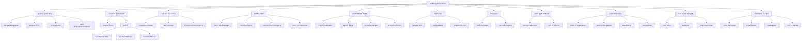

### 2.2. Sơ đồ phân rã chức năng

Sơ đồ cây chức năng (Functional Decomposition) thể hiện các nhóm chức năng và chức năng con của hệ thống.

```mermaid
graph TD
  A["Hệ thống đặt lịch khám"]

  A --> A1["Quản lý người dùng"]
  A1 --> A1a["Đăng ký/Đăng nhập"]
  A1 --> A1b["Xác thực OTP"]
  A1 --> A1c["Hồ sơ cá nhân"]
  A1 --> A1d["RBAC (Patient/Doctor/Admin)"]

  A --> A2["Tìm kiếm & Khám phá"]
  A2 --> A2a["Chuyên khoa"]
  A2 --> A2b["Bác sĩ"]
  A2b --> A2b1["Lọc theo địa điểm"]
  A2b --> A2b2["Lọc theo đánh giá"]
  A2b --> A2b3["Xem hồ sơ bác sĩ"]

  A --> A3["Lịch làm việc bác sĩ"]
  A3 --> A3a["Tạo/Chỉnh sửa slot"]
  A3 --> A3b["Báo bận/Nghỉ"]
  A3 --> A3c["Đồng bộ hiển thị lịch trống"]

  A --> A4["Đặt lịch khám"]
  A4 --> A4a["Chọn bác sĩ/ngày/giờ"]
  A4 --> A4b["Chống trùng lịch"]
  A4 --> A4c["Hủy/Dời theo chính sách"]
  A4 --> A4d["Khám trực tiếp/Online"]

  A --> A5["Khám bệnh & Hồ sơ"]
  A5 --> A5a["Ghi chú chẩn đoán"]
  A5 --> A5b["Kê đơn điện tử"]
  A5 --> A5c["Đính kèm kết quả"]
  A5 --> A5d["Xem lịch sử khám"]

  A --> A6["Thanh toán"]
  A6 --> A6a["Tạo giao dịch"]
  A6 --> A6b["Xử lý callback"]
  A6 --> A6c["Hóa đơn/Lịch sử"]

  A --> A7["Thông báo"]
  A7 --> A7a["Nhắc lịch email"]
  A7 --> A7b["Xác nhận/Hủy/Dời"]

  A --> A8["Đánh giá & Phản hồi"]
  A8 --> A8a["Đánh giá sau khám"]
  A8 --> A8b["Hiển thị điểm số"]

  A --> A9["Quản trị hệ thống"]
  A9 --> A9a["Quản lý chuyên khoa"]
  A9 --> A9b["Quản lý phòng khám"]
  A9 --> A9c["Duyệt bác sĩ"]
  A9 --> A9d["Nhật ký/Audit"]

  A --> A10["Báo cáo & Thống kê"]
  A10 --> A10a["Lượt khám"]
  A10 --> A10b["Doanh thu"]
  A10 --> A10c["Top chuyên khoa"]

  A --> A11["Tích hợp & Hạ tầng"]
  A11 --> A11a["Cổng thanh toán"]
  A11 --> A11b["Email Service"]
  A11 --> A11c["Meeting Link"]
  A11 --> A11d["Lưu trữ tài liệu"]
```

