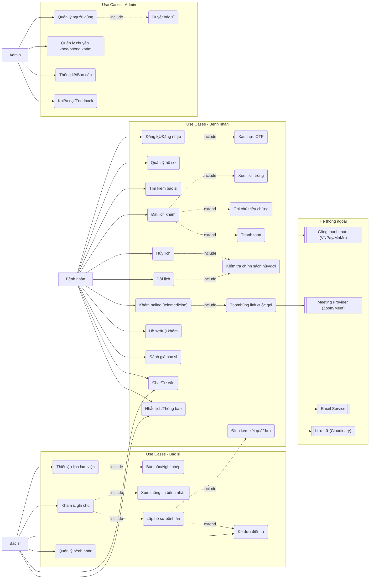

### 2.3. Use Case Diagram

Sơ đồ thể hiện mối quan hệ giữa các tác nhân (Bệnh nhân, Bác sĩ, Admin) và các chức năng chính của hệ thống.

Ghi chú: cạnh nét đứt có nhãn include/extend biểu thị quan hệ bắt buộc/mở rộng giữa các use case.

