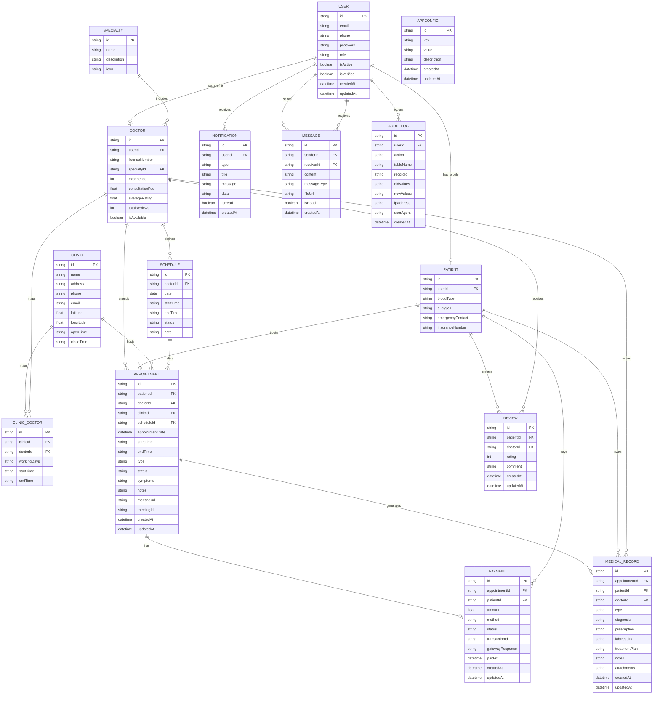

### 4.2. Thiết kế cơ sở dữ liệu

#### ERD tổng quan

#### Ghi chú quan hệ và ràng buộc
- Mỗi `User` có tối đa một `Patient` hoặc một `Doctor` (1-0..1). Hai hồ sơ này loại trừ lẫn nhau theo vai trò.
- `User.email`, `User.phone`, `Doctor.licenseNumber`, `Specialty.name`, `Payment.transactionId` là duy nhất (unique).
- `Doctor` thuộc một `Specialty` (n-1). `Specialty` có nhiều `Doctor`.
- `Doctor` có nhiều `Schedule` (1-n). Mỗi `Schedule` xác định ngày + khung giờ duy nhất cho bác sĩ.
- `Appointment` liên kết `Patient` — `Doctor` — (tùy chọn) `Clinic` — (tùy chọn) `Schedule`.
- `Payment` và `MedicalRecord` là 1-1 với `Appointment` (tối đa một bản ghi cho mỗi cuộc hẹn).
- `Review` là quan hệ n-n giữa `Patient` và `Doctor` với ràng buộc duy nhất 1 đánh giá cho mỗi cặp.
- `ClinicDoctor` là bảng mapping n-n giữa `Clinic` và `Doctor` với ràng buộc duy nhất theo cặp (clinicId, doctorId).
- `Notification`, `Message`, `AuditLog` gắn với `User`; `Message` có quan hệ người gửi/người nhận.

